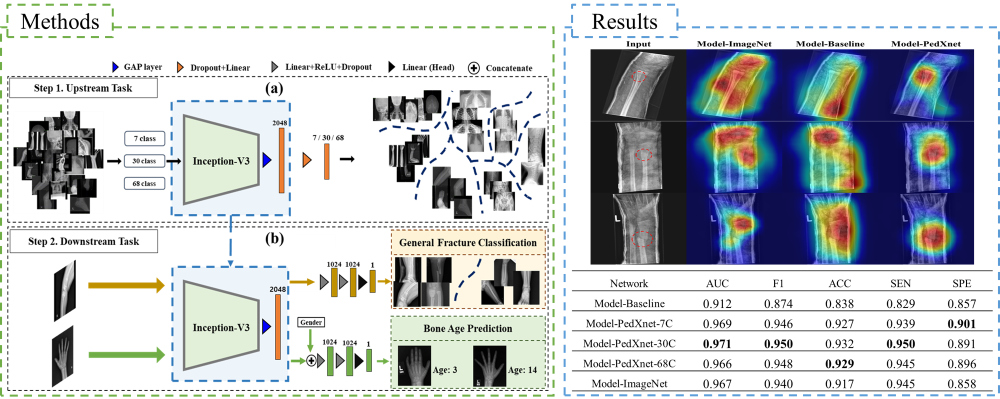

# PedXnet - Official Pytorch Implementation

It is currently incomplete. It will be still updated.

<p align="center"></p>

## 💡 Highlights
+ Three class-balanced pediatric radiograph datasets (PedXnets) by radiographic views labeling have been constructed.

+ Robust representation was developed by a radiographic views recognition task on the PedXnets.

+ Radiographic view representations using Model-PedXNets have been validated by applying them to two pediatric medical tasks, which showed better performance than Model-Baseline, and even equivalent and better performance than Model-ImageNet.


## Paper
This repository provides the official implementation code of PedXnet in the following paper:<br/>
<b>Supervised representation learning based on various levels of pediatric radiographic views for transfer learning</b><br/><br/>
Authors: [Sunggu Kyung](https://github.com/babbu3682), Miso Jang, Seungju Park, Hee Mang Yoon, Gil-Sun Hong, Namkug Kim<br/><br/>
[MI2RL LAB](https://www.mi2rl.co/)<br/><br/>
(Under revision...) Nature Scientific Report<br/>


## Requirements
+ Linux
+ CUDA 11.6
+ Python 3.8.5
+ Pytorch 1.13.1

## 📦 PedXnet Framework
### 1. Clone the repository and install dependencies
```bash
$ git clone https://github.com/babbu3682/PedXnet.git
$ cd MTD-GAN/
$ pip install -r requirements.txt
```
# 여기부터
### 2. Preparing data
#### Download the dataset from [GRAZPEDWRI-DX](https://figshare.com/articles/dataset/GRAZPEDWRI-DX/14825193).

- The processed dataset directory structure as follows:
```
data/
    train
        |--  0001_1297860395_01_WRI-L1_M014.png
        |--  0001_1297860435_01_WRI-L2_M014.png
                    .
                    .
                    .
    valid
        |--  0010_0604034401_01_WRI-L1_M014.png
        |--  0010_0604034442_01_WRI-L2_M014.png
                    .
                    .
                    .
    test
        |--  0066_1261433016_01_WRI-L1_M011.png
        |--  0066_1261433167_01_WRI-L2_M011.png
                    .
                    .
                    .
```

### script examples

**• train**:
```bash
CUDA_VISIBLE_DEVICES=4 python -W ignore train.py \
--dataset 'GRAZPEDWRI_DX' \
--train-batch-size 20 \
--valid-batch-size 20 \
--train-num-workers 20 \
--valid-num-workers 20 \
--model 'Downtask_General_Fracture_PedXNet_30Class' \
--loss 'Downtask_GRAZPEDWRI_DX_Loss' \
--optimizer 'adam' \
--scheduler 'poly_lr' \
--epochs 200 \
--warmup-epochs 5 \
--lr 1e-4 \
--min-lr 1e-6 \
--multi-gpu-mode 'Single' \
--device 'cuda' \
--print-freq 10 \
--save-checkpoint-every 1 \
--checkpoint-dir '/workspace/sunggu/3.Child/PedXnet_Code_Factory/checkpoints/Fracture/GRAZPEDWRI_DX_InceptionV3_PedXNet_30Class' \
--save-dir '/workspace/sunggu/3.Child/PedXnet_Code_Factory/predictions/train/Fracture/GRAZPEDWRI_DX_InceptionV3_PedXNet_30Class' \
--memo 'inceptionV3, test, node14'
```

**• test**:
```bash
CUDA_VISIBLE_DEVICES=2 python -W ignore test.py \
--dataset 'GRAZPEDWRI_DX' \
--test-batch-size 20 \
--test-num-workers 20 \
--model 'Downtask_General_Fracture_PedXNet_30Class' \
--loss 'Downtask_GRAZPEDWRI_DX_Loss' \
--multi-gpu-mode 'Single' \
--device 'cuda' \
--checkpoint-dir '/workspace/sunggu/3.Child/PedXnet_Code_Factory/checkpoints/Fracture/GRAZPEDWRI_DX_InceptionV3_PedXNet_30Class_TEST' \
--save-dir '/workspace/sunggu/3.Child/PedXnet_Code_Factory/predictions/test/Fracture/GRAZPEDWRI_DX_InceptionV3_PedXNet_30Class_TEST' \
--resume "/workspace/sunggu/3.Child/PedXnet_Code_Factory/checkpoints/Fracture/GRAZPEDWRI_DX_InceptionV3_PedXNet_30Class/epoch_?_checkpoint.pth" \
--memo 'inceptionV3, test, node14' \
--epoch ?
```

## 🙏 Excuse
We indeed welcome the opportunity to make our dataset and model publicly available, to foster collaboration and further research within the community. However, regarding the dataset, as it comprises medical data, it must receive approval from the Asan Hospital Institutional Review Board (IRB). Therefore, the dataset will be made available on a request-only basis. Please contact us by email by filling out the appropriate form.

## 📝 Citation
If you use this code for your research, please cite our papers:
```
⏳ It's scheduled to be uploaded soon.
```

## 🤝 Acknowledgement
We acknowledge the open-source libraries, including the [Albumentations](https://albumentations.ai/docs/).

### 🛡️ License <a name="license"></a>
Project is distributed under [MIT License](https://github.com/babbu3682/PedXnet/blob/main/LICENSE)
